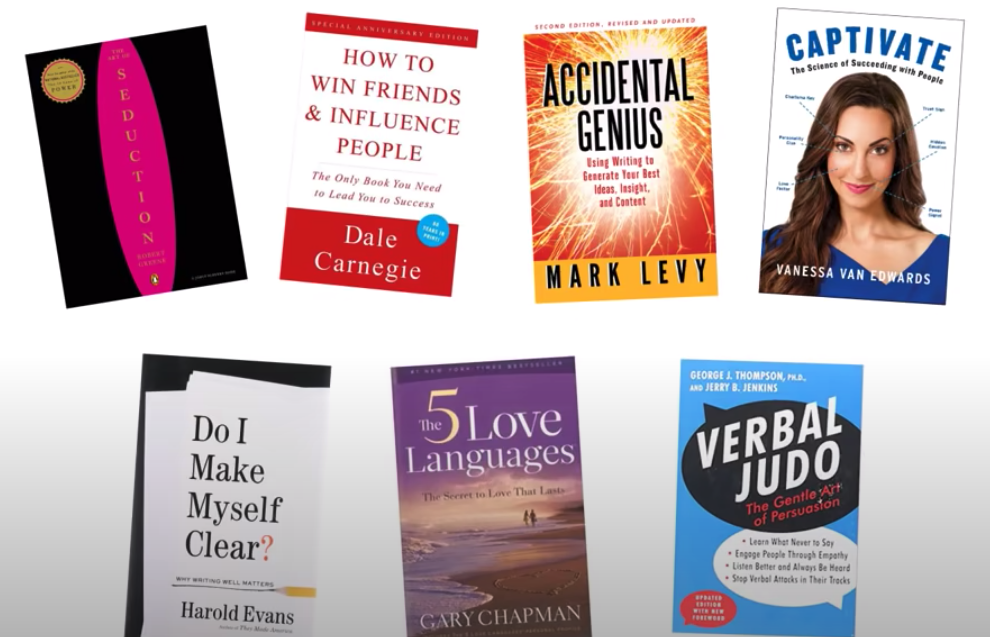

# Book - How to talk to anyone - Leil Lowndes
## How to avoid questions that you don't want to answer?
* **Broken Record (audio player) technique**
  * Stick to the first answer if someone keeps persuading to get more details or answers to the question you don't want to answer

## How to always have something interesting to say?
* **Latest New Technique**
    * Brush up on latest news whenever you go for a meeting/meetup/get-together etc.
    * News is highly likely to be relevant to be talked about.

## How to talk when you don't want to?
* **Parrotting technique**
    * Follow up on what others are saying - pick stuff from what they said, and ask back.
    * As a side effect/bonus the other person will feel respected and being aware of the fact that you are interested in him, likely it is that he too is, in you (Networking)
    * Ofcourse, not for long :P .

## How to build a good image of yours without boot licking/flattering? OR How to make your image without being a brown noser?
* **Grapevine communication technique**
    * Suppose you want to impress person A.
    * Praise A before A's friend (when A is not present there)
    * Indirect praises create impact (positive).

## A more effective way to thank
* Add a reason.
* Plain "thanks!" looks like a _mere_ formality (doesn't add to to the emotion, based on context)
------

# Other books
